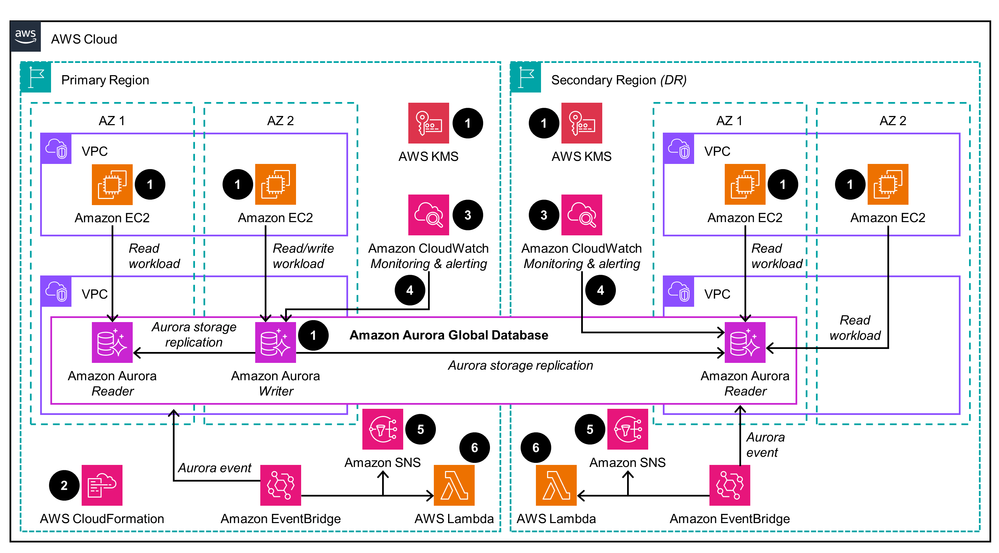

# Disaster Recovery Solutions for Amazon Aurora 

AWS architecturally builds in safeguards against outages and incidents to minimize service disruptions. Disaster recovery capabilities are incorporated into AWS services to enable resilience when disruptions occur, reducing the impact to customers and service continuity. A key part of resilience is disaster recovery (DR) - the ability to respond to disastrous events that severely impact business operations. Effective DR relies on defined business objectives of Recovery Point Objective (RPO) to avoid data loss, and Recovery Time Objective (RTO) to reduce downtime. Workloads must be architected with resilience to meet RPO and RTO targets in a disaster scenario, enabling business continuity. This architectural approach maintains operations through an established Business Continuity Plan (BCP).

This guide provides a comprehensive overview of disaster recovery solutions for Amazon Aurora. It covers the reference architectures, planning considerations, and configuration steps for deploying disaster recovery on AWS. The guide targets Database Admins, DevOps Engineers, Solution Architects, Business leaders, and Cloud professionals aiming to implement Amazon Aurora disaster recovery. 
 
### Architecture

This solution is built with two primary components: 
1) **Comprehensive disaster recovery with Amazon Aurora Global Database:** Amazon Aurora Global Database, created by deploying the solution’s AWS CloudFormation template. As part of the solution, we will create a secondary region as part of the Aurora Global Database replication topology and other required services, such as AWS CloudWatch Dashboard for monitoring and AWS Lambda to customize Aurora Global Database swichover or failover to support the Disaster Recovery scenarios.
2) **AWS Backup to centralize Aurora backups:** Use these templates to launch the Amazon Backup solution for your Amazon Aurora cluster. To demonstrate as part of the solution, we will be implementing Cross-account, cross-region backup. However, you can customize the parameters to meet your specific use cases such as Cross-account, same-region and Same-account, cross-region. 

For more information refer to the implementation gudie. 

### Solution 1: Amazon Aurora Global Databases

The solution’s disaster recovery option with Amazon Aurora Global Database provides the following components and workflows, which are shown as numbered steps in the following diagram.



0.	An existing [Amazon Aurora](https://docs.aws.amazon.com/AmazonRDS/latest/AuroraUserGuide/CHAP_AuroraOverview.html) Regional cluster is required to deploy this solution. The application can be running on the [Amazon EC2](https://docs.aws.amazon.com/AWSEC2/latest/UserGuide/concepts.html) instances, [Amazon EKS](https://docs.aws.amazon.com/eks/latest/userguide/what-is-eks.html) or [Amazon ECS](https://docs.aws.amazon.com/AmazonECS/latest/developerguide/Welcome.html) or any of your choice. In this solution we assume the application is deployed on EC2 instances across multiple availability zones. An Amazon Aurora cluster can be encrypted using default [Amazon KMS](https://docs.aws.amazon.com/AmazonRDS/latest/AuroraUserGuide/Overview.Encryption.Keys.html) or using [customer managed key (CMK)](https://docs.aws.amazon.com/AmazonRDS/latest/AuroraUserGuide/Overview.Encryption.Keys.html).
1.	Once the prerequisites are complete, the [AWS CloudFormation](https://docs.aws.amazon.com/AWSCloudFormation/latest/UserGuide/Welcome.html) stack provided as part of this guidance will create resources including [Amazon Aurora Read Replica](https://docs.aws.amazon.com/AmazonRDS/latest/AuroraUserGuide/aurora-replicas-adding.html) in the Primary Region if not exists already, [Aurora Global Database](https://docs.aws.amazon.com/AmazonRDS/latest/AuroraUserGuide/aurora-global-database.html) with Reader instance in the Secondary Region. [Amazon CloudWatch](https://docs.aws.amazon.com/AmazonCloudWatch/latest/monitoring/WhatIsCloudWatch.html) Dashboard, [Amazon SNS](https://docs.aws.amazon.com/sns/latest/dg/welcome.html) topic [AWS Lambda](https://docs.aws.amazon.com/lambda/latest/dg/welcome.html) function and [Amazon EventBridge](https://docs.aws.amazon.com/eventbridge/latest/userguide/eb-what-is.html) rules are deployed in both the regions.
2. & 2DR An Amazon CloudWatch Dashboard is configured in the Primary region and the Secondary region to monitor Amazon Aurora related key metrics along with replication status.
3. & 3DR. An Amazon CloudWatch alarm is created in both the regions to generate an alarm for [AuroraGlobalDBReplicationLag](https://docs.aws.amazon.com/AmazonRDS/latest/AuroraUserGuide/Aurora.AuroraMonitoring.Metrics.html#Aurora.AuroraMySQL.Monitoring.Metrics.clusters) metric and notify through an Amazon SNS topic.
4. & 4DR. An Amazon EventBridge rule is configured for both planned switchovers and unplanned failover and notify through Amazon SNS topic when the event occurs and also calls Amazon Lambda function in both the regions.
5. & 5DR. An AWS Lambda function provides a framework to add any additional functionalities during the [planned switchover](https://docs.aws.amazon.com/AmazonRDS/latest/AuroraUserGuide/aurora-global-database-disaster-recovery.html#aurora-global-database-disaster-recovery.managed-failover) or [unplanned outage](https://docs.aws.amazon.com/AmazonRDS/latest/AuroraUserGuide/aurora-global-database-disaster-recovery.html#aurora-global-database-failover) event. Some of the functionality can be, but not limited to 
    1. Application can be configured to use [Amazon Route 53](https://docs.aws.amazon.com/Route53/latest/DeveloperGuide/Welcome.html) endpoint which could be pointing to the primary region. During the planned switchover or unplanned outage event, the Route53 endpoint can be updated to point to the newly promoted region. No application configuration is required during the planned switchover or unplanned outage event.
    2. Application may require a restart after the database planned switchover or unplanned outage event. It depends on how the application is configured, it could be the restart of the EC2 instance or restart of the application deployment pods in the EKS cluster.


### Solution 2: AWS Backup

The solution’s disaster recovery option with AWS Backup provides the following components and workflows, which are shown as numbered steps in the following diagram.


1.	A pre-existing organizational structure set up within [AWS Organizations](https://docs.aws.amazon.com/organizations/latest/userguide/orgs_introduction.html) is necessary to establish cross-account AWS backup between two accounts: Account A, which serves as the Production/Source account, and Account B, designated as the Central Backup/Target account. It's also important to note that you have the flexibility to include multiple target accounts according to this provided guidance.
2.	An existing [Amazon Aurora](https://docs.aws.amazon.com/AmazonRDS/latest/AuroraUserGuide/Aurora.CreateInstance.html) cluster in the Production/ source account, encrypted using a [customer managed key (CMK)](https://docs.aws.amazon.com/AmazonRDS/latest/AuroraUserGuide/Overview.Encryption.Keys.html)  which is shared across the source and target accounts. The cluster should also be [tagged](https://docs.aws.amazon.com/AmazonRDS/latest/UserGuide/USER_Tagging.html) appropriately so the solution can identify the desired resources for backup.
3.	Once the above prerequisites are complete, [AWS CloudFormation](https://aws.amazon.com/cloudformation/) will be used to deploy the solution resources in your source and target AWS accounts and Regions. The required CloudFormation stacks are provided as part of this solution. 
4.	After the CloudFormation resources are deployed, the Aurora cluster in Region A of the Production account is backed by AWS Backup as per the schedule provided by you while deploying the solution. The backups are stored in an [AWS Backup vault](https://docs.aws.amazon.com/aws-backup/latest/devguide/vaults.html) encrypted with [AWS KMS (CMK)](https://docs.aws.amazon.com/kms/latest/developerguide/concepts.html). 
5.	AWS Backup then copies the backup to cross account i.e. the central backup/ target account and stores it in the backup vault of Account B_Region A. The backup vault is encrypted using a [CMK](https://docs.aws.amazon.com/kms/latest/developerguide/concepts.html) created by CloudFormation. 
6.	Once the cross-account backup copy is complete, an [EventBridge rule](https://docs.aws.amazon.com/eventbridge/latest/userguide/eb-rules.html) in the Production account forwards a “backup copy complete” notification to the Central Backup account event bus (Account B_ Region A) to notify it of the action. 
7.	The above notification is identified as an incoming event by the EventBridge rule in the central backup/ target account in Region A. 
8.	Once the event is received in the central backup account, the EventBridge rule triggers an [AWS Lambda](https://aws.amazon.com/lambda/) function to finally copy the backup to the desired destination Region i.e. Account B_Region B and store it in the AWS Backup vault in Region B. 
9.	The backup of your Aurora cluster is now available in the central backup/ target account in Region B and is stored in the AWS Backup vault of Region B. The backup vault is encrypted with AWS KMS (CMK). This backup can be used to [restore](https://docs.aws.amazon.com/aws-backup/latest/devguide/restoring-aur.html) the Aurora database 


### File Structure

```
├── aurora-dr-solution
│   ├── CODE_OF_CONDUCT.md
│   ├── CONTRIBUTING.md
│   ├── README.md
│   ├── assets
│   │   ├── aurora_global_database_arch.png
│   │   └── awsbackup_arch.png
│   ├── scripts
│   │   ├── AWSBackup_cleanup_stacksets.sh
│   │   └── AWSBackup_deploy_stacksets.sh
│   └── templates
│       ├── AWSBackup_source.yaml
│       ├── AWSBackup_staging.yaml
│       ├── AWSBackup_target.yaml
│       ├── AWSCloudFormationStackSetAdministrationRole.yaml
│       ├── AWSCloudFormationStackSetExecutionRole.yaml
│       └── AmazonAurora_GlobalDatabasae_DR_Solution.yaml
```


## Deploy the Guidance

### Solution 1: Deploying the solution with Amazon Aurora Global Database

Critical workloads with a global footprint, such as financial, travel, or gaming applications, have strict availability requirements and may need to tolerate a Region-wide outage. Traditionally, this required difficult tradeoffs between performance, availability, cost, and data integrity. Aurora Global Database uses storage-based replication with typical latency of less than 1 second, using dedicated infrastructure that leaves your database fully available to serve application workloads. In the unlikely event of a Regional degradation or outage, one of the secondary Regions can be promoted to read and write capabilities in less than 1 minute. In this solution we will be implementing Aurora Global database as a comprehensive Disaster recovery solution.

This solution will deploy resources using CloudFormation across two regions - The primary region (us-east-2) & The secondary region (us-west-2). 
The primary region (Region A) already contains an Amazon Aurora Cluster that requires a disaster recovery implementation in the secondary region (Region B).

#### Prerequisites

1.	An existing Aurora MySQL or Aurora PostgreSQL cluster for which you would like to configure [Amazon Aurora Global Databases](https://aws.amazon.com/rds/aurora/global-database/). 
2.	Amazon Aurora cluster can be configured with default  [AWS KMS key](https://docs.aws.amazon.com/kms/latest/developerguide/concepts.html#kms_keys) or Customer Managed Key (CMK) for encryption or without storage level encryption. Currently solution supports all the above combination. However, highly recommend [encryption at rest](https://docs.aws.amazon.com/AmazonRDS/latest/AuroraUserGuide/Overview.Encryption.html) using either default [AWS KMS key](https://docs.aws.amazon.com/kms/latest/developerguide/overview.html) or [Customer managed key](https://docs.aws.amazon.com/AmazonRDS/latest/AuroraUserGuide/Overview.Encryption.Keys.html).
3.	Ensure that  `AWSCloudFormationStackSetAdministrationRole` role, and `AWSCloudFormationStackSetExecutionRole` role are created in the primary Aurora database cluster resides. For more information see [Grant self-managed permissions](https://docs.aws.amazon.com/AWSCloudFormation/latest/UserGuide/stacksets-prereqs-self-managed.html)
4.	Install and  configure the latest version of the [AWS CLI (2.2.37 or newer)](https://aws.amazon.com/cli/) and Python 3.10 on the  machine you are going to use to interact with the solution. This can be  your personal laptop, an EC2 instance, Cloud9 or similar machine. Set up the AWS credentials for the user who is authenticated to set up the stacks in the Primary region. 


### Deployment process overview for Amazon Aurora Global Database


#### 1. Clone the repository

Clone this git repository.
```
git clone https://gitlab.aws.dev/db-ssa/aurora-dr-solution.git
```

#### 2. Create the CloudFormation stacks in the Primary Region A 

As a prerequisites, you create two CloudFormation stacks in the Production account where the primary Aurora database cluster resides. The stack creates the following roles. You can find more information on these roles in the [AWS CloudFormation documentation](https://docs.aws.amazon.com/AWSCloudFormation/latest/UserGuide/stacksets-prereqs-self-managed.html). 

* **AWSCloudFormationStackSetAdministrationRole**
* **AWSCloudFormationStackSetExecutionRole**

The Cloudformation template files associated with the above role creations are [AWSCloudFormationStackSetAdministratonRole.yml](AWSCloudFormationStackSetAdministrationRole.yml) and [AWSCloudFormationStackSetExecutionRole.yml](AWSCloudFormationStackSetExecutionRole.yml)

#### 3. Run the CloudFormation stack in the Primary Region A

In this section, we will create the Aurora Global Database and other required services to support the Disaster recovery solution.

Deploy the cloudformation template using the file [AmazonAurora_GlobalDatabasae_DR_Solution.yaml](AmazonAurora_GlobalDatabasae_DR_Solution.yaml) in the repository

Here the list of sample parameters along with the description

| Parameter Name                 | Parameter Description                      | Sample Value                   |
|--------------------------------|--------------------------------------------|--------------------------------|
| StackName                      | Name of the Stack                          | AuroraGlobalDatabaseSolution   |
| NotificationEmailAddress       | Email address to notify for any alarm      | mynotificationemail@domain.com |
| HeadlessCluster                | No Reader replica in the Secondary Region  | No                             |
| GlobalDatabaseIdentifier       | Name of the global database Identifier     | apg-global-dr-sol              |
| PrimaryClusterIdentifier       | Name of the Primary cluster identifier     | apg-dr-sol-us-east-2           |
| DashboardNamePrefix            | Cloudwatch Dashboard Prefix                | agd                            |
| SecondaryRegionName            | Secondary Region name                      | us-west-2                      |
| SecondaryDBSubnetID            | Secondary Region Database Subnet Group ID  | apg-dr-sol-subnet              |
| SecondarySecurityGroupID       | Secondary Region Security Group ID         | sg-06bd2742xxxxx               |
| SecondaryEncryptionKeyAlias    | Secondary Region Encryption Key Alias Name | apg-dr-sol-key                 |
| SecondaryClusterIdentifier     | Secondary Region Cluster Identifier        | apg-dr-sol-us-west-2           |
| SecondaryInstanceIdentifier    | Secondary Region Instance Identifier       | apg-dr-sol-us-west-2-1         |
| SecondaryClusterParameterGroup | Secondary Region Cluster Parameter Group   | default                        |
| SecondaryDBParameterGroup      | Secondary Region Database Parameter Group  | default                        |


Once the CloudFormation stack is deployed successfully, it would have provisioned the following resources

* If the Amazon Aurora Cluster in the primary region is not already configured for Multi-AZ, this capability will be enabled as part of the CloudFormation stack deployment. This will create an Aurora reader instance in a different availability zone (AZ) from the writer instance, matching the writer configuration in terms of instance type and parameter group.
* Creates a Global database with the name provided during the stack deployment.
* Adds secondary region to the global database.
* Adds a reader instance in the secondary region based on the configuration information provided during the stack deployment.
* Creates CloudWatch dashboard with the predefined monitoring metrics.
* Configures CloudWatch alarm for Aurora Global database replication lag.
* Provides Lambda functions to handle Global Database planned switchovers or unplanned outages.
* Configures Amazon SNS notification to alert for CloudWatch Alarm and Global database planned switchovers/unplanned outage.


#### 4. Monitor and test failover 

As part of the CloudFormation deployment, we have created the following services to monitor Aurora Global Database.

* CloudWatch Dashboard on both the regions 
* Global ReplicationLag Alarm

To monitor Aurora Global Database metrics.  Navigate to **CloudWatch Console** --→ Click on **Dashboard** in the AWS console. The CloudWatch dashboard calls custom lambda function to identify if the cluster is Primary or Secondary and requires a permission to execute.  Please click **Execute them all**. For more information refer to implementation guide 

The deployment created sample Global ReplicationLag  metric alarm which will send email notification if the [AuroraGlobalDBReplicationLag](https://docs.aws.amazon.com/AmazonRDS/latest/AuroraUserGuide/Aurora.AuroraMonitoring.Metrics.html#Aurora.AuroraMySQL.Monitoring.Metrics.clusters) is more than 600 sec (i.e., 10 minutes) and can be configurable.

Validation of the Amazon Aurora Global database can be done by switching over the cluster using [managed planned switchover](https://docs.aws.amazon.com/AmazonRDS/latest/AuroraUserGuide/aurora-global-database-disaster-recovery.html#aurora-global-database-disaster-recovery.managed-failover) from the console. After completion of either a planned switchover or unplanned outage, the process will send an event to Eventbridge which in turn generate an email via SNS and execute the skeleton Lambda function code.

**Note:** AWS Lambda function provides a framework to add any additional functionalities during the planned switchover or unplanned outage event. As a prescriptive guidance, we are providing the framework. You can leverage the AWS Lambda funciation to do 
* Application can be configured to use [Amazon Route53 CNAME](https://docs.aws.amazon.com/Route53/latest/DeveloperGuide/ResourceRecordTypes.html#CNAMEFormat) which could be pointing to the primary region. During the planned switchover or unplanned outage event, the Route53 endpoint can be updated to point to the newly promoted region. No application configuration is required during the planned switchover or unplanned outage event.
* Application may require a restart after the database planned switchover or unplanned outage event. Depends on how the application is configured, it could be the restart of the EC2 instance or restart of the application deployment pods in the Amazon EKS cluster.

For details steps, review the implementation guide.

### Solution 2: Deploying the solution with AWS Backup

As part of this solution, we will be implementing Cross-account, cross-region backup. However, depends on your RPO and RTO you can customize the parameters to meet your specific usecases such as Cross-account, same-region and Same-account, cross-region.


#### Prerequisites

1. An existing organization  structure configured in [AWS  Organizations](https://aws.amazon.com/organizations/), refer to [Creating an organization](https://docs.aws.amazon.com/organizations/latest/userguide/orgs_manage_org_create.html). For this solution, we have used an AWS  Organization with two accounts with Account A which will be referred to as the Production Account or  OU Account and Account B as the Central Backup Account or member account. Depending on your use case, you can choose to have 0 member accounts or multiple member accounts. 
2. An existing Amazon Aurora MySQL or Amazon Aurora PostgreSQL cluster for which you would like to set cross account-cross Region backups. 
3. The Amazon Aurora database should be encrypted with a non-default KMS key and the KMS key should be shared  with all accounts to which the snapshot is to be copied, refer to [Allowing access to an AWS KMS key](https://docs.aws.amazon.com/AmazonRDS/latest/AuroraUserGuide/aurora-share-snapshot.html). 
4. [Opting in](https://docs.aws.amazon.com/aws-backup/latest/devguide/service-opt-in.html) for backing up the  appropriate services, Amazon Aurora in this case, in each Region that you  want to use AWS Backup to manage backups.
5. Also validate that [cross-account backups have been enabled](https://docs.aws.amazon.com/aws-backup/latest/devguide/manage-cross-account.html#enable-cross-account) in AWS Backup in the management account. 
6. Appropriate IAM permissions to  deploy a CloudFormation Stack on the Production OU account and in the  central backup member accounts as well. 
7. Install and  configure the latest version of the [AWS CLI (2.2.37 or newer)](https://aws.amazon.com/cli/) and Python 3.10 on the  machine you are going to use to interact with the solution. This can be  your personal laptop, an EC2 instance, Cloud9 or similar machine. [Set up the AWS credentials](https://docs.aws.amazon.com/cli/latest/userguide/cli-configure-envvars.html#envvars-set) for the user who is authenticated to set up the stacks in the production (OU) account. 

For more details on the above prerequisites, refer to the implementation guide. 


### Deployment process overview for AWS Backup

1. Clone the repository and set AWS credentials for your account. 

```
# untar the repo into a working directory, and 'cd' to working directory.

# set AWS_SECRET_ACCESS_KEY, AWS_ACCESS_KEY_ID for the IAM user that has required 
# privileges to deploy cloudformation template in the AWS account that has OU configured
# for source and target accounts

git clone https://gitlab.aws.dev/db-ssa/aurora-dr-solution.git

cd aurora_dr_solution

export AWS_ACCESS_KEY_ID=<access-key>
export AWS_SECRET_ACCESS_KEY=<secret>
export AWS_DEFAULT_REGION=<source region>
```

For more details, refer to [Environment variables to configure the AWS CLI](https://docs.aws.amazon.com/cli/latest/userguide/cli-configure-envvars.html).

2. Create `AWSCloudFormationStackSetAdministrationRole` in the source or Production OU account in the source region. 

3. Create `AWSCloudFormationStackSetExecutionRole` in the source or Production OU account in the source region and target or Central backup account in the target region. For both creations, under AdministratorAccountId provide the AWS Account ID of your Production or source account.

4. Tag the desired Aurora DB cluster with tag backup-plan and value rds-backup-plan,  refer to [Tagging Amazon RDS resources](https://docs.aws.amazon.com/AmazonRDS/latest/UserGuide/USER_Tagging.html). 

5. Run the `deploy_stacksets.sh` bash script that accepts set of parameters and determines the type of central backup solution that is needed based on input parameters (Same account cross-Region, Cross account same-Region or Cross account cross-Region) and deploys required resources to source and target accounts/regions. The input parameters to the script are described below. 


| Parameter Name                 | Parameter Description                      | Default                        |
|--------------------------------|--------------------------------------------|--------------------------------|
| pBackupVaultName               | Backup Vault name on source and target     | default                        |
| pSourceBackupAccountID         | Backup source account id                   | default                        |
| pTargetBackupAccountID         | Backup target account id                   | default                        |
| pSourceAWSRegion               | Backup source region                       | default                        |
| pDestinationAWSRegion          | Backup target region                       | default                        |
| pAWSOrganizationID             | AWS Organization ID                        | default                        |
| pBackupPlanName                | Backup Plan name in backup vault           | default                        |
| pScheduleExpression            | Schedule/cron expression for backup job    | default                        |
| pBackupTagKey                  | Tag name for Amazon Aurora source database | default                        |
| pBackupTagValue                | Tag value for Amazon Aurora source database| default                        |
| pDeleteAfterDays               | Number of days to retain backup            | default                        |


For more details on the above parameters, review the implementation guide. Below are sample parameters for the shell script. You can use the example below and plug the values for your AWS resources. 

You can use the sample script to plug in the values for your AWS resources and keep other parameters as is. Parameters that need to be altered as per your AWS resources are: `pSourceBackupAccountID`, `pTargetBackupAccountID`, `pSourceAWSRegion`, `pDestinationAWSRegion`, and `pAWSOrganizationID`. In this example, Amazon Aurora snapshot will be created every 4 hours as provided in the [cron job schedule expression](https://docs.aws.amazon.com/eventbridge/latest/userguide/eb-cron-expressions.html). 


 for e.g. source account 330----00030 source region us-east-2 
 target account 117----05459 target region us-east-1


    bash ./scripts/AWSBackup_deploy_stacksets.sh --pBackupVaultName 'btest' \
    --pSourceBackupAccountID '330****00030' \
    --pTargetBackupAccountID '117****05459' \
    --pSourceAWSRegion 'us-east-1' \
    --pDestinationAWSRegion 'us-west-2' \
    --pAWSOrganizationID 'r---6' \
    --pBackupPlanName 'backup-plan' \
    --pScheduleExpression 'cron(0 0/4 * * ? *)' \
    --pBackupTagKey 'backup-plan' \
    --pBackupTagValue 'rds-backup-plan' \
    --pDeleteAfterDays 1

6. Once the backups are created and visible in the AWS Backup console of the target account under the `btest` backup vault, you can restore a new Aurora cluster using the backups in the central backup account. For detailed steps refer to [Restoring an Amazon Aurora cluster](https://docs.aws.amazon.com/aws-backup/latest/devguide/restoring-aur.html). Refer to the implementation guide for more details on this step. 

## Uninstall the Guidance

### Soluiton 1: Uninstall the deployment for Amazon Aurora Global Database

To uninstall this solution, you must delete the AWS CloudFormation stack and any other stacks that were created as a result of the Aurora DR Solution. Because some AWS CloudFormation stacks use IAM roles created by previous stacks, you must delete AWS CloudFormation stacks in the reverse order they were created (delete the most recent stack first, wait for the stack deletion to be completed, and then delete the next stack). 

#### 1. Using the AWS Management Console 

* Sign in to the AWS CloudFormation console
* Select the following solutions stack one at a time and Delete it. Please make sure the Primary Region is same as when the deployment started. In this example it is us-east-2
    * AuroraGlobalDatabaseSolution
    * AWSCloudFormationStackSetAdministrationRole
    * AWSCloudFormationStackSetExecutionRole


#### 2. Using AWS Command Line Interface

 Determine whether the AWS Command Line Interface (AWS CLI) is available in your environment. For installation instructions, see What Is the AWS Command Line Interface in the AWS CLI User Guide. After confirming that the AWS CLI is available, use the following command and provide `--stackname` 

```
$ aws cloudformation delete-stack --stack-name <installation-stack-name>
```

Deleting the CloudFormation stack, deletes all the resources provisioned as part of the deployment. It is recommended that you use tags to ensure that all resources associated with Amazon Aurora DR Solution are deleted. For example, all resources created by the CloudFormation should have the same tag. Then you can use Resources Groups & Tag Editor to confirm that all resources with the specified tag are deleted.

### Solution 2: Uninstall the deployment for AWS Backup

To uninstall, you must delete 1/ All the [AWS Backup recovery points](https://docs.aws.amazon.com/aws-backup/latest/devguide/deleting-backups.html) and 2/ The AWS CloudFormation stacks that were created as a result of the AWS Backup solution. 

In order to so, you can run the below steps on your AWS CLI terminal with the user role that has the correct administrator privileges.
 
**Note:** 
* To run below scripts, make sure you are in the correct directory where you cloned the git repository.
* You will need to export your credentials and [configure your AWS CLI credentials](https://docs.aws.amazon.com/cli/latest/userguide/cli-configure-envvars.html) for the corresponding IAM user in the target account

1. To Delete backup recovery points from the backup vault using the below script in all regions such as,  `target account target region`, `target account source region`, and `source account source region`.  . 
**Note** You can delete the [Backup recovery points](https://docs.aws.amazon.com/aws-backup/latest/devguide/deleting-backups.html#deleting-backups-manually) from each Region manually.

If you used the default backup vault name ‘btest’ then you can run this script without any changes.

```
pBackupVaultName="btest"; export pBackupVaultName
 for rarn in `aws backup list-recovery-points-by-backup-vault --backup-vault-name "${pBackupVaultName}" --query 'RecoveryPoints[].RecoveryPointArn' --output text`
 do
 aws backup delete-recovery-point --backup-vault-name "${pBackupVaultName}" --recovery-point-arn ${rarn} 
 done
```

Up on running the above script across source and target accounts, deletes all recovery points from the backup vaults. 

2. Run the below script in the Production OU/ source account in the primary region. This script deletes all the three StackSets which were created in the source Production OU account and source region. 

```
bash ./scripts/AWSBackup_cleanup_stacksets.sh --pBackupVaultName "btest" \
 --pSourceBackupAccountID "330----00030" \
 --pTargetBackupAccountID "117----05459" \
 --pSourceAWSRegion "us-east-2" \
 --pDestinationAWSRegion "us-east-1"
 ```

3. Lastly, we will delete the CloudFormation stacks `AWSCloudFormationStackSetExecutionRole` and `AWSCloudFormationStackSetAdministrationRole` that we had created in the source and target accounts. You can do so by either using the below AWS CLI commands or directly from the AWS console as well.

Delete `AWSCloudFormationStackSetAdministrationRole` from source account in source region. 

```
aws cloudformation delete-stack --stack-name AWSCloudFormationStackSetAdministrationRole 
```

Delete `AWSCloudFormationStackSetExecutionRole` from the source account in source region and target account in target region. 

```
aws cloudformation delete-stack --stack-name AWSCloudFormationStackSetExecutionRole
```

You can also perform this step from the AWS console. For detailed steps to delete a stack, refer to [Deleting a stack on the AWS CloudFormation console](https://docs.aws.amazon.com/AWSCloudFormation/latest/UserGuide/cfn-console-delete-stack.html).
 
With the above steps, you have successfully uninstalled the AWS Backup solution. For more information refer to implementation guide.

---
### License
Copyright Amazon.com, Inc. or its affiliates. All Rights Reserved.

Licensed under the Apache License Version 2.0 (the "License"). You may not use this file except in compliance with the License. A copy of the License is located at

    http://www.apache.org/licenses/

or in the "license" file accompanying this file. This file is distributed on an "AS IS" BASIS, WITHOUT WARRANTIES OR CONDITIONS OF ANY KIND, express or implied. See the License for the specific language governing permissions and limitations under the License.
